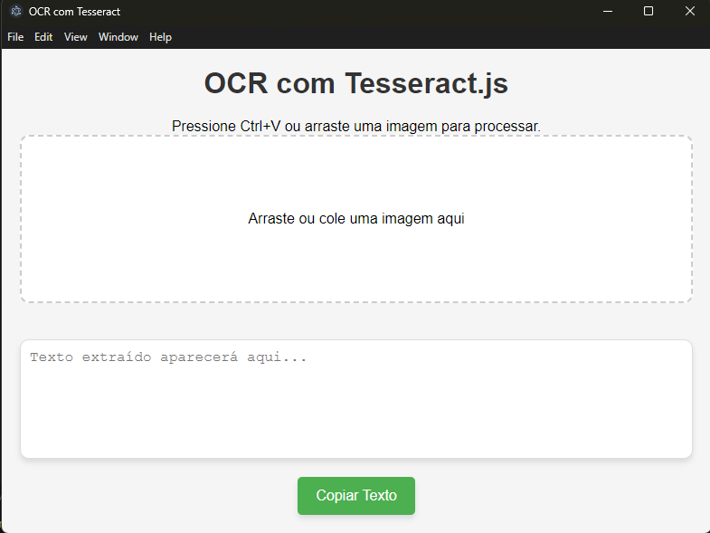

# 📸 Copy Image Text

## 📝 Sobre o projeto

O **Copy Image Text** é um aplicativo desenvolvido com Electron que permite extrair texto de imagens copiadas para a área de transferência (Ctrl+V) ou arrastadas para a interface. Ele utiliza **Tesseract.js** para reconhecimento óptico de caracteres (OCR) e **Jimp** para processamento de imagem.

## 📦 Instalação e Execução

### 🔧 Passo 1: Instalar as dependências

Abra o terminal na pasta do projeto e execute:

```sh
npm install
```

### ▶️ Passo 2: Iniciar o aplicativo

```sh
npm start
```

O aplicativo será iniciado e você poderá colar ou arrastar imagens para extrair o texto.

## 📷 Interface do Aplicativo



## 🛠 Tecnologias Utilizadas

- **Electron**: Para criar o aplicativo desktop.
- **Tesseract.js**: Para reconhecimento de texto em imagens.
- **Jimp**: Para processamento e otimização de imagens.

## 🤝 Contribuição

Sinta-se à vontade para contribuir com melhorias, abrindo issues ou enviando pull requests! 😊

---

📌 **Autor:** Lucas Guilha

📅 **Última atualização:** 02/2025

